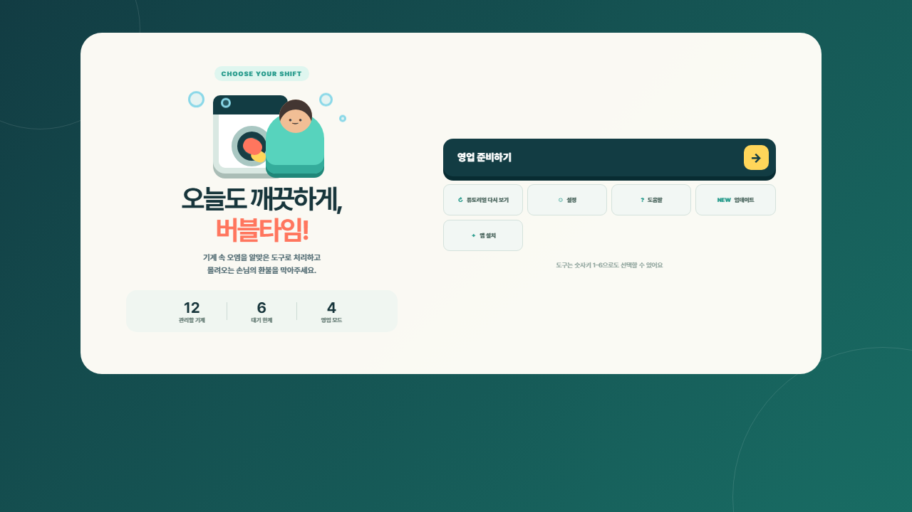

# Bubble Time

손님과 세탁기 6대·건조기 6대를 동시에 관리하는 브라우저 세탁소 운영 게임입니다. 오염에 맞는 도구를 빠르게 골라 기계를 청소하고, 대기 줄이 6명에 도달하지 않도록 매장 사건과 손님 흐름을 관리합니다.



## 현재 상태

- 현재 버전: `2.11.0`
- 배포 방식: GitHub `main` 푸시 후 Vercel 자동 배포
- 기술 구성: HTML, CSS, Vanilla JavaScript
- 저장 방식: 브라우저 `localStorage`
- 온라인 순위·클라우드 저장: 아직 포함하지 않음
- 설치형 실행: PWA 지원

별도의 프레임워크나 빌드 과정 없이 정적 파일만으로 실행됩니다.

## 게임 목표

영업 시간 동안 다음 두 조건을 지키면 영업에 성공합니다.

1. 오염된 기계 사용으로 발생하는 환불을 최대한 줄입니다.
2. 대기 손님이 6명에 도달하지 않도록 깨끗한 빈 기계를 확보합니다.

점수뿐 아니라 환불 수, 손님 만족도, 최고 콤보, 대기 줄, 추가 목표 달성 여부에 따라 최종 등급과 보상이 결정됩니다.

## 영업 모드

| 모드 | 시간 | 특징 |
| --- | ---: | --- |
| 빠른 영업 | 45초 | 짧은 플레이와 빠른 재도전에 적합 |
| 기본 영업 | 75초 | 기존 밸런스를 사용하는 표준 모드 |
| 긴 영업 | 120초 | 더 많은 손님과 사건을 관리하는 장기 영업 |
| 무한 영업 | 제한 없음 | 30초 이후 일시정지 화면에서 안전 정산 가능 |

각 모드는 목표 수치와 등급 기준이 플레이 시간에 맞게 조정되며, 최고 점수와 등급도 모드별로 따로 저장됩니다.

## 난이도

| 난이도 | 손님 흐름 | 인내심 | 사건 빈도 |
| --- | --- | --- | --- |
| 여유 영업 | 느림 | 길음 | 낮음 |
| 표준 영업 | 기본 | 기본 | 기본 |
| 피크 타임 | 빠름 | 짧음 | 높음 |

영업 모드와 난이도는 각각 선택할 수 있습니다. 결과 화면에서는 같은 조건 재도전, 새 목표 선택, 상위 난이도 도전 또는 홈으로 바로 이동할 수 있습니다.

## 조작

1. 화면 아래에서 청소 또는 관리 도구를 선택합니다.
2. 해당 도구가 필요한 기계, 손님 또는 설비를 누릅니다.

| 입력 | 동작 |
| --- | --- |
| 마우스 클릭·모바일 터치 | 도구 선택 및 대상 처리 |
| 숫자키 `1`–`6` | 도구 선택 |
| `P` 또는 `Esc` | 영업 일시정지 |
| `Enter` | 준비 화면에서 영업 시작 |

모바일 터치, 키보드 포커스, 스크린 리더 안내, 고대비, 글자 크기, 색각 보조와 모션 감소 설정을 지원합니다.

## 도구와 처리 대상

| 도구 | 처리 대상 | 사용 위치 |
| --- | --- | --- |
| 스퀴지 | 물때 | 오염된 세탁기·건조기 |
| 먼지털이 | 먼지 | 오염된 세탁기·건조기 |
| 빨래 바구니 | 놓고 간 세탁물 | 오염된 세탁기·건조기 |
| 얼룩 제거제 | 수상한 얼룩 | 얼룩이 있는 손님 |
| 정비 렌치 | 기계 고장 | 고장 표시가 난 기계 |
| 세제 보충통 | 세제 부족 | 빈 세제 탱크 |

정전은 별도 도구 없이 매장 아래의 차단기를 눌러 복구합니다. 일반 손님에게 잘못된 도구를 사용하면 오조작 벌금이 발생합니다.

## 손님 유형

| 손님 | 특징 |
| --- | --- |
| 일반 손님 | 기본 인내심·작업 시간·보상 |
| 성격 급한 손님 | 인내심이 짧지만 작업이 빠르고 보상이 높음 |
| 단골 손님 | 오래 기다려 주며 보상이 높음 |
| 대량 세탁 손님 | 기계를 오래 사용하지만 큰 보상을 제공 |
| 세탁소 평론가 | 해금 후 드물게 등장하는 고위험·고보상 손님 |

일부 손님은 수상한 얼룩을 입고 등장합니다. 얼룩 제거제를 올바르게 사용하면 전용 연출과 보너스를 확인할 수 있습니다.

## 랜덤 매장 사건

| 사건 | 대응 |
| --- | --- |
| 기계 고장 | 정비 렌치로 고장 난 기계 수리 |
| 정전 | 차단기를 눌러 매장 전력 복구 |
| 세제 부족 | 세제 보충통으로 탱크 충전 |
| 단체 손님 | 한꺼번에 들어오는 손님을 위해 빈 기계 확보 |
| 위생 검사 | 제한 시간 안에 매장의 모든 오염 제거 |

사건 발생 전 예고가 표시되며, 빠르게 해결하면 추가 점수와 영업 목표 진행도를 얻습니다. 일일 매장 조건과 주간 사건 규칙에 따라 특정 오염이나 사건이 더 자주 나타날 수 있습니다.

## 성장과 반복 플레이

- 영업마다 무작위 추가 목표 2개 제공
- 수익을 사용한 고속 모터·청소 도구 3단계 강화
- 점장 XP, 레벨, 명성 시스템
- 업적 7종과 일일 도전
- 주간 목표 3종과 주간 플레이 페이스 보상
- 손님·오염·사건·업그레이드 도감
- 간판·바닥·벽지·화분 매장 꾸미기
- 최근 10회 영업 기록과 운영 분석
- S등급·무환불·레벨업 전용 결과 연출과 사운드
- 점수와 등급을 이미지 또는 문구로 공유하는 결과 카드

## 화면 구조

자주 방문하는 기능은 팝업을 반복해서 열지 않고 전용 화면 사이를 이동합니다.

```text
홈 → 영업 준비 → 게임 → 결과
 └→ 관리 센터
     ├─ 성장: 강화·업적
     ├─ 컬렉션: 도감·꾸미기
     ├─ 기록
     └─ 설정
```

데스크톱 관리 센터는 왼쪽 메뉴와 오른쪽 콘텐츠의 2열 구조이며, 모바일에서는 네 개의 관리 그룹이 화면 아래에 고정됩니다. 관리 기능끼리 이동할 때 배경 블러나 팝업 등장 애니메이션을 반복하지 않고 콘텐츠만 짧게 전환합니다.

실제 오버레이 모달은 일시정지와 영업 중 빠른 설정처럼 현재 흐름을 잠시 중단해야 하는 기능에만 사용합니다. 모바일 홈은 바깥 여백과 둥근 카드가 없는 전체 페이지이며, MANAGER DESK·영업 준비·설정·도움말·업데이트는 홈 오른쪽에서 들어와 `← 홈`으로 돌아갑니다. 복귀 중에는 완성된 홈을 아래에 계속 표시해 화면이 다시 페이드되거나 깜박이지 않습니다. 전용 화면이 열려 있을 때는 배경 게임 화면의 스크롤을 잠가 이중 스크롤을 방지합니다.

### 모바일 화면 원칙

390px 폭을 기준으로 한 모바일 화면은 데스크톱 정보를 단순히 축소하지 않고 우선순위를 다시 구성합니다.

- 홈: 100dvh 전체 페이지에서 `MANAGER DESK`·영업 준비·보조 버튼을 354px 콘텐츠 폭으로 넓히고, 주요 버튼은 10px·보조 버튼은 8px 간격으로 정렬
- 화면 이동: MANAGER DESK·영업 준비·설정·도움말·업데이트를 동일한 좌우 슬라이드 페이지로 전환하고 복귀 시 홈 재등장 애니메이션을 생략. 관리 센터와 설정 탭 사이도 이전·다음 방향에 맞춰 두 페이지가 함께 좌우로 이동
- 영업 준비: 모드·난이도·오늘의 목표·매장 조건만 먼저 표시하고 완료된 주간 목표 목록은 숨김
- 게임 HUD: 40px 상단 행에는 남은 시간·매출·환불과 일시정지만 두고, 콤보·만족도·대기 인원은 바로 아래 상태 행으로 분리. 최고 기록과 중복 설정·음향 버튼은 영업 중 숨김
- 매장: 390×844에서 실제 플레이 영역을 639px 이상 확보하고, 세탁기 6대와 건조기 6대를 각각 3열 2행으로 배치해 12대 모두 첫 화면에 표시. 고장·사건·손님 완료 안내는 첫 기계보다 위의 30px 상단 칩으로 표시
- 도구판: 여섯 도구를 42px 높이의 3열 2행으로 배치하고 도구명을 11px 이상으로 유지하며 버튼 사이는 2px로 정리
- 결과: 주요 정보 간격을 8px로 통일해 핵심 점수와 등급을 먼저 표시하고, 목표·손님 유형·운영 분석은 `상세 영업 기록`으로 접어 제공
- 관리·설정: 하단 네 그룹 탐색을 유지하면서 설명, 버튼, 설정 라벨 글자 크기를 확대

모바일 홈·영업 준비의 핵심 행동과 게임 HUD·기계 12대·도구 6개가 390×844 첫 화면 안에 들어오는지 회귀 검사합니다. 354px 홈 버튼, 설정 탭 양방향 슬라이드, 깜박임 없는 복귀, 639px 매장과 기계를 가리지 않는 알림도 함께 검사합니다.

## 자동 저장과 영업 복구

현재 게임 데이터는 모두 브라우저에 저장됩니다.

| 저장 키 | 내용 |
| --- | --- |
| `bubbleTime75.progression.v1` | 수익, 강화, 도감, 설정, 업적, 영업 기록과 모드별 최고 기록 |
| `bubbleTime75.bestRecord.v1` | 기존 75초 최고 기록 호환 데이터 |
| `bubbleTime.shiftCheckpoint.v1` | 진행 중인 영업 체크포인트 |
| `bubbleTime75.seenVersion` | 업데이트 안내 확인 버전 |

진행 중인 영업은 약 2초마다 체크포인트를 만듭니다. 탭을 닫거나 새로고침해도 12시간 안에는 다음 상태를 복구할 수 있습니다.

- 선택한 모드·난이도·추가 목표
- 점수, 환불, 콤보와 영업 통계
- 대기 손님과 인내심
- 기계의 오염·고장·작업 진행도
- 정전·세제 부족과 진행 중인 매장 사건

복구된 영업은 즉시 진행되지 않고 일시정지 화면에서 시작하므로, 플레이어가 준비한 뒤 재개할 수 있습니다. 설정 화면에서는 진행 데이터를 JSON 파일로 내보내거나 가져올 수 있습니다.

브라우저 데이터나 사이트 저장 공간을 삭제하면 로컬 진행 정보도 함께 사라집니다.

## PWA와 오프라인 실행

`manifest.webmanifest`와 `sw.js`를 사용해 설치형 웹 앱으로 실행할 수 있습니다.

- 192px·512px 일반 아이콘
- 512px 마스커블 아이콘
- 데스크톱·모바일 설치 스크린샷
- 앱 셸과 이미지 자산 오프라인 캐시
- 새 서비스 워커 적용 안내
- 모바일 홈 화면 설치 지원

최초 방문에서 필요한 파일을 받은 이후에는 네트워크가 불안정해도 캐시된 게임을 실행할 수 있습니다. 현재 진행 정보는 온라인 서버가 아니라 각 브라우저의 로컬 저장소에 남습니다.

## 로컬 실행

별도의 패키지 설치나 빌드는 필요하지 않습니다. 저장소 루트에서 정적 웹 서버를 실행합니다.

```bash
python -m http.server 4173
```

브라우저에서 `http://localhost:4173`으로 접속합니다. 서비스 워커와 PWA 기능을 정확히 확인하려면 HTML 파일을 직접 여는 대신 로컬 서버를 사용해야 합니다.

## 검사

Node.js 22 이상에서 다음 검사를 실행할 수 있습니다.

```bash
node --check script.js
node tests/laundry-game-balance.cjs
node tests/laundry-game-release.cjs
node tests/laundry-game-ui.cjs
```

| 검사 | 확인 내용 |
| --- | --- |
| `laundry-game-balance.cjs` | 대응 속도별 생존율, 환불, 최대 대기 줄과 실패 시점 |
| `laundry-game-release.cjs` | 필수 UI·기능·PWA 자산·PNG 크기와 온라인 기능 제외 상태 |
| `laundry-game-ui.cjs` | 실제 브라우저에서 전용 홈·관리 센터 전환, 모드 선택, 오염 청소, 고장·정전·세제 대응, 체크포인트 복구, 결과→홈 이동, 모바일 354px 홈 버튼·설정 탭 양방향 슬라이드·깜박임 없는 복귀·결과 간격·639px 매장·비침범 알림·3×2 도구판·고정 탐색 |

UI 회귀 검사는 설치된 Chrome 또는 Edge를 헤드리스 모드로 실행합니다. 브라우저를 자동으로 찾지 못하면 `BROWSER_PATH` 환경 변수를 지정합니다.

## 프로젝트 구조

```text
.
├─ index.html                 홈·관리·게임 화면과 필수 모달
├─ styles.css                반응형 레이아웃과 연출
├─ game-config.js            밸런스 상수
├─ script.js                 게임 상태와 전체 로직
├─ manifest.webmanifest      PWA 메타데이터
├─ sw.js                     오프라인 캐시와 업데이트
├─ icon.svg                  기본 벡터 아이콘
├─ icon-maskable.svg         마스커블 아이콘 원본
├─ assets/                   설치 아이콘·스크린샷·공유 카드
└─ tests/
   ├─ laundry-game-balance.cjs
   ├─ laundry-game-release.cjs
   └─ laundry-game-ui.cjs
```

게임의 숫자 밸런스는 `game-config.js`, 기능과 상태 전환은 `script.js`, 화면 구조는 `index.html`에서 관리합니다.

## 배포

현재 저장소의 `main` 브랜치가 Vercel 프로젝트와 연결되어 있습니다.

```text
local change → test → commit → push main → Vercel automatic deployment
```

정적 사이트이므로 별도 빌드 명령은 필요하지 않습니다. 배포 전에 최소한 정적 검사와 UI 회귀 검사를 통과시키는 것을 권장합니다.

## 온라인 저장 검토: Firebase Firestore

온라인 저장을 추가한다면 Firestore는 현재 구조와 잘 맞는 후보입니다. 정적 Vercel 배포를 유지하면서 웹 SDK로 사용자별 진행 데이터를 저장할 수 있고, Firebase Authentication의 익명 계정은 로그인 화면 없이 사용자별 문서를 보호한 뒤 나중에 정식 계정으로 연결할 수 있습니다.

다만 이번 버전에는 Firebase SDK, 로그인, Firestore 컬렉션, 온라인 순위가 포함되어 있지 않습니다. 로컬 게임이 안정적으로 동작하는 현재 상태를 기준선으로 유지합니다.

### 권장 데이터 구조

```text
users/{uid}
└─ saves/current
   ├─ schemaVersion
   ├─ progression
   ├─ updatedAt
   └─ clientVersion

runs/{runId}
├─ uid
├─ mode
├─ difficulty
├─ score
├─ rank
├─ duration
└─ createdAt
```

### 권장 구현 순서

1. Firebase 프로젝트와 웹 앱을 만들고 Authentication 익명 로그인을 연결합니다.
2. `users/{uid}/saves/current`에 사용자 본인만 읽고 쓸 수 있는 Security Rules를 작성합니다.
3. 로컬 저장을 기본으로 유지하고, 영업 종료나 명시적인 동기화 시점에만 클라우드에 저장합니다.
4. `schemaVersion`과 서버 시간을 사용해 로컬·클라우드 충돌 정책을 정합니다.
5. Firestore Emulator로 권한 규칙과 잘못된 데이터 쓰기를 테스트합니다.
6. App Check를 적용한 뒤 클라우드 저장을 공개합니다.
7. 순위표는 별도 단계에서 추가하고, 클라이언트가 점수를 직접 확정하지 않도록 검증 경로를 둡니다.

2초마다 생성되는 영업 체크포인트는 Firestore에 계속 쓰지 않고 지금처럼 로컬에만 두는 편이 좋습니다. 클라우드는 장기 진행 정보와 완료된 영업 기록에 집중해야 쓰기 횟수와 충돌을 줄일 수 있습니다.

Security Rules는 데이터 접근 권한과 형태를 제한할 수 있지만, 브라우저에서 계산한 점수가 실제 플레이 결과인지 완전히 증명하지는 못합니다. 공개 순위표를 만들 때는 App Check와 함께 Cloud Functions 또는 신뢰할 수 있는 서버 검증을 추가하는 것이 안전합니다.

참고 문서:

- [Firebase 익명 인증](https://firebase.google.com/docs/auth/web/anonymous-auth)
- [Cloud Firestore 오프라인 데이터](https://firebase.google.com/docs/firestore/manage-data/enable-offline)
- [Firestore Security Rules](https://firebase.google.com/docs/firestore/security/get-started)
- [Security Rules Emulator 테스트](https://firebase.google.com/docs/firestore/security/test-rules-emulator)
- [Firebase App Check](https://firebase.google.com/docs/app-check)
- [Firestore 트랜잭션과 일괄 쓰기](https://firebase.google.com/docs/firestore/manage-data/transactions)

## 다음 개발 후보

- Firebase Authentication·Firestore 기반 선택형 클라우드 저장
- 검증 가능한 모드별 주간 순위
- 저장 충돌 해결 UI와 계정 연결
- 실제 플레이 로그를 바탕으로 한 모드·난이도별 밸런스 조정
- PWA 설치와 오프라인 복구에 대한 실기기 테스트 확대

온라인 기능은 로컬 저장과 오프라인 플레이를 방해하지 않는 선택 기능으로 추가하는 것을 원칙으로 합니다.
